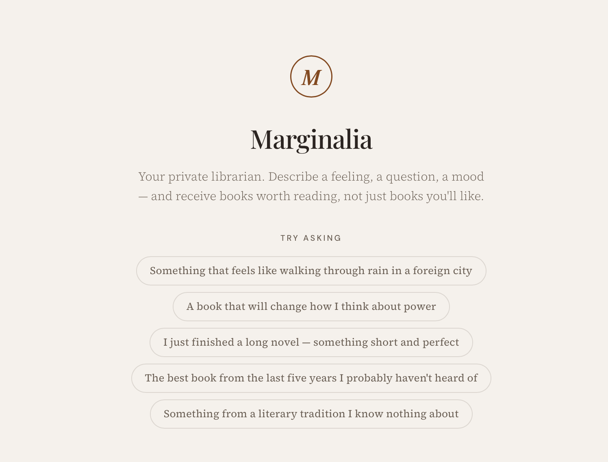
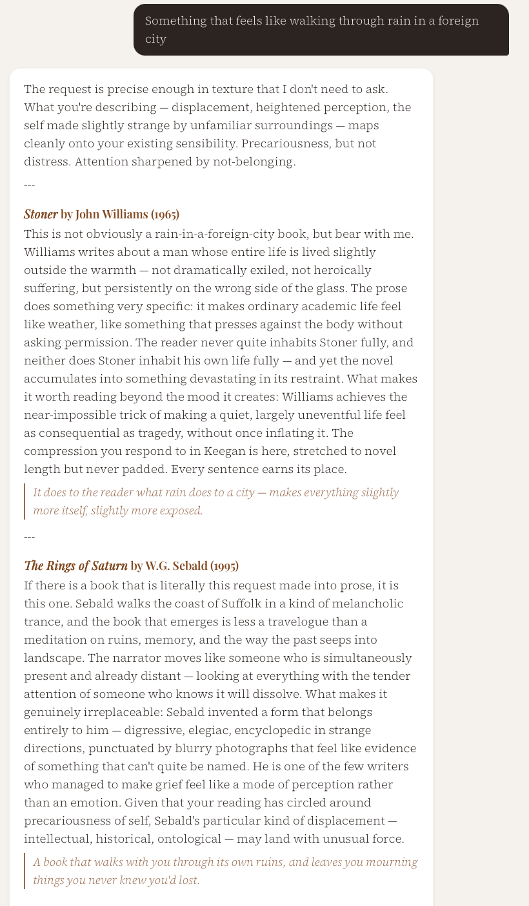
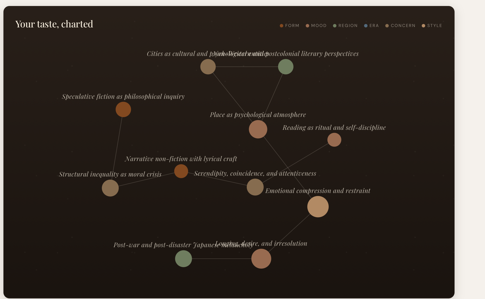
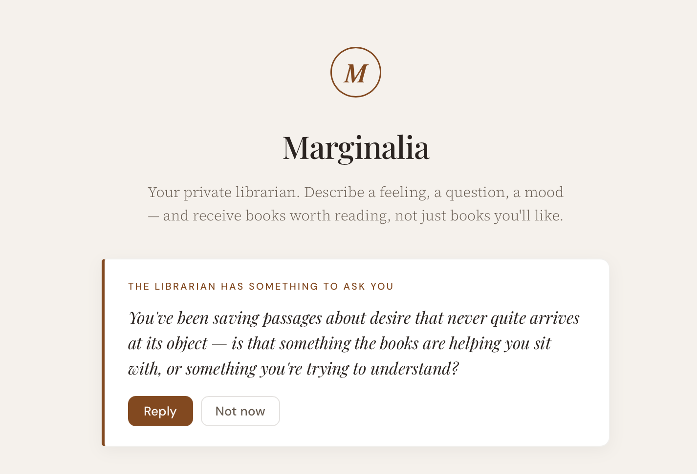

# Marginalia

A personal literary curator — a private royal librarian who suggests books based on a feeling, mood, or question, tracks what you read, and builds a living portrait of your taste.






Single-user, self-hosted, BYOK. Clone the repo, add your Anthropic API key, run two commands, and you have your own librarian.

## What it does

- **Chat with a librarian in four voices** — The Sage, The Bookseller, The Provocateur, The Companion. Streamed responses with optional web search for in-print and recency-sensitive recommendations.
- **Library** — books on shelves (reading / read / want to read / abandoned), each with covers fetched automatically from Google Books, ratings, dates, notes, and passages you've collected.
- **Suggestions inbox** — every recommendation the librarian has ever made, with the reason and the persona that suggested it. One click to add to your library or dismiss.
- **Taste portrait** — a Sonnet-written prose portrait of you as a reader, refreshed automatically as you read, write notes, and chat. Rendered as:
  - a **constellation** of themes and the connections between them
  - **key observations** pulled from the prose
  - a **delta card** showing what's shifted since the last portrait
- **Reading goal** with pace tracking
- **Monthly book gallery** showing every book you finished, by month, with covers
- **Search** (⌘K) across every message, note, and passage
- **The librarian asks you questions** — sometimes, when it notices a real shift in your reading

## Quick start

You'll need Python 3.9+ and an [Anthropic API key](https://console.anthropic.com).

```bash
# 1. Clone & install
git clone https://github.com/<you>/marginalia.git
cd marginalia
python3 -m venv .venv
source .venv/bin/activate
pip install -r requirements.txt

# 2. Configure
cp .env.example .env
# edit .env — paste your ANTHROPIC_API_KEY

cp profile.example.json profile.json
# edit profile.json — set your name

# 3. Run
uvicorn backend.main:app --reload
# → http://localhost:8000
```

A terminal-only chat is also available:

```bash
python chat.py
```

And a small CLI for managing your library directly:

```bash
python library.py log "Stoner" "John Williams" --rating 5
python library.py books
python library.py sugs
```

See [Usage.md](Usage.md) for more.

## How it works

The system is a thin FastAPI app over a single SQLite file (`curator.db`). Every chat is *stateless on the LLM side* — a context assembler builds the system prompt from scratch on every turn:

```
voice persona  +  core librarian instructions  +  taste portrait
              +  reading history summary  +  suggestion history  +  conversation so far
```

That's the central trick: the LLM doesn't remember anything; the system reconstructs continuity each time. As your library and notes grow, the librarian gets more accurate without retraining or fine-tuning.

A few specific design choices:

- **The taste portrait is prose, not scores.** A Sonnet call reads your reading log, notes, passages, and conversation signals, and writes a 3–5 paragraph portrait. The librarian reads its own portrait every conversation.
- **The librarian tracks what it has suggested.** Every book mentioned in a chat becomes a tracked suggestion. The system can re-surface a book months later when your taste has shifted, or skip books you've dismissed.
- **Web search is server-side.** Claude's `web_search` tool runs server-side at Anthropic. Used sparingly, capped at 3 searches/turn, with a UI toggle to disable.
- **Single-user.** No auth, no user table. One instance = one reader. This keeps the code small, the privacy story simple, and the data inspectable (open `curator.db` in any SQLite viewer).

Models in use:

| Role | Model |
|------|-------|
| Chat conversation, taste portrait | `claude-sonnet-4-6` |
| Signal extraction from user messages | `claude-haiku-4-5-20251001` |

## Cost

You bring your own Anthropic key. Rough costs per chat turn:

- Sonnet response: $0.01–0.04 (depending on length and context size)
- Haiku signal extraction: ~$0.0005
- Web search (when triggered): $0.01 per search, up to 3/turn

Taste portrait refresh is roughly $0.05 and only fires after meaningful changes (cooldown + delta check). Most days, your bill is small change.

## Tech stack

- **Backend:** Python 3.9+, FastAPI, SQLAlchemy 2, SQLite (with FTS5 for search)
- **LLM:** Anthropic SDK (BYOK)
- **Book metadata:** Google Books API (free, no key required)
- **Frontend:** Plain HTML + vanilla JS + CSS — no build step, no framework
- **Fonts:** Playfair Display + Source Serif 4 + DM Sans (loaded from Google Fonts)

## Project structure

```
marginalia/
├── backend/
│   ├── main.py               # FastAPI app, lifespan
│   ├── config.py             # .env + profile.json loaders
│   ├── database.py           # engine, session, migrations
│   ├── models.py             # SQLAlchemy models
│   ├── context_assembler.py  # builds the system prompt
│   ├── book_resolver.py      # Google Books lookup + cover sweep
│   ├── taste_engine.py       # portrait, delta, signals, librarian-prompts
│   ├── search.py             # FTS5 index + ORM event listeners
│   └── routes/               # chat, sessions, library, suggestions,
│                             # profile, stats, search, prompts
├── frontend/
│   ├── index.html            # chat
│   ├── library.html          # book shelves
│   ├── suggestions.html      # inbox
│   ├── taste.html            # portrait + constellation
│   └── static/{css,js}/
├── chat.py                   # terminal chat client
├── library.py                # library CLI
├── PLAN.md                   # original design doc (historical)
└── Usage.md                  # detailed usage notes
```

## License

MIT — see [LICENSE](LICENSE).
